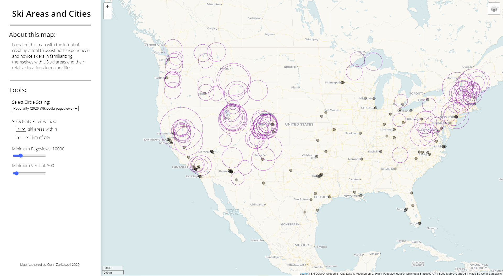

# US Ski Areas and Cities

### Corin Zarkowski

---

## Introduction

I created this map with the intent of creating a tool to assist both experienced and novice skiers in familiarizing themselves with United States ski areas and their relative distances to major cities. Tools included in the web map include sliders to adjust what ski areas are visible, based on both popularity (Wikipedia pageviews), and total vertical drop, a menu to select the basis of circle scaling between popularity and vertical, and a filter to only show cities with a given amount of ski areas in a given radius.

## Goal

With these tools, users can view trends in both ski area location and general vertical. For example, on initial viewing of the map, one might see the giant cluster of areas in the northeast and assume it to be the centerpiece of United States skiing. However, when the filters are applied for popularity and vertical, a large amount of ski areas in the northeast disappear while the clusters in the west become more prenounced. Using the city filter can allow the user to determine ski access from different US cities. An avid skier looking to move across the United States might look for a large amount of ski areas in a close radius, while a more casual skier might such search for a single opportunity to ski in a larger radius. The supplied tools are versatile and may be used for a variety of purposes.

## Data

I sourced ski data from Wikipedia, using a python web-scraper and some regex. Due to Wikipedia's very inconsistent formatting over the large ski area dataset, and the tiny scale of some areas, many ski areas lack a vertical drop statistic. They are represented differently on the map. For my city data, I downloaded a CSV of the 1000 most populated cities in the United States from https://gist.github.com/Miserlou/11500b2345d3fe850c92. Finally, for my pageview data on each ski area, I used the Wikimedia Statistics API.
The basemap is Voyager via CartoDB

## Libraries

I used jquery for event management, leaflet for all map-related utility, and the font 'Open Sans', sourced from Google Fonts.

---

Thank you to Professor Bo Zhao and my wonderful TA Tyler McCrea for providing me with the relevant abilities to create this web map and tool on a topic I've always loved.
